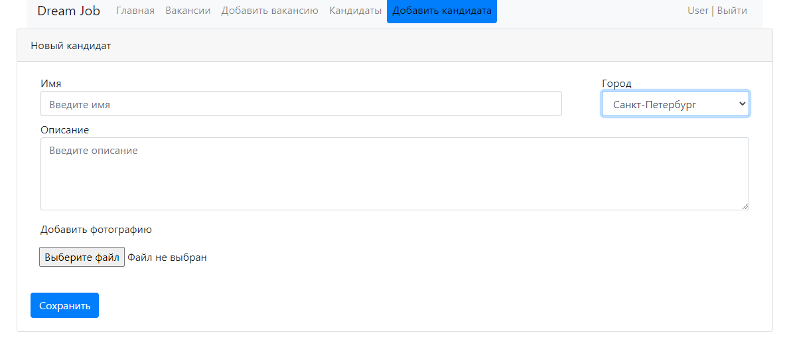
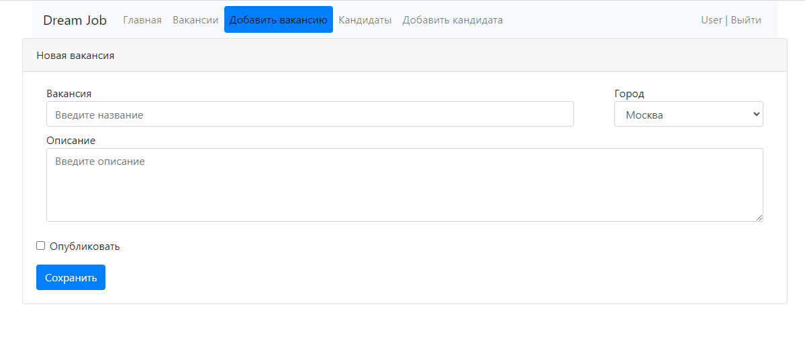
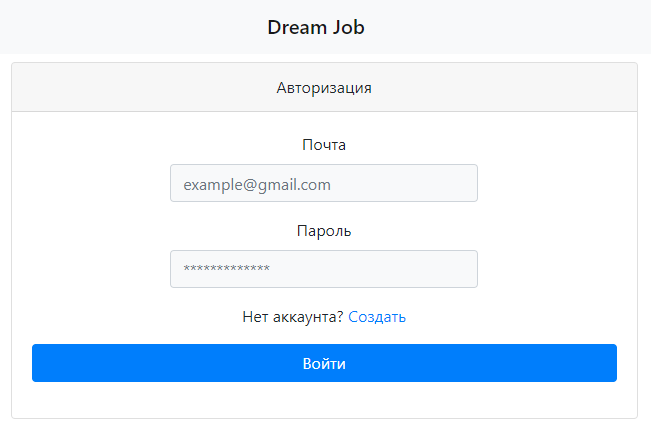
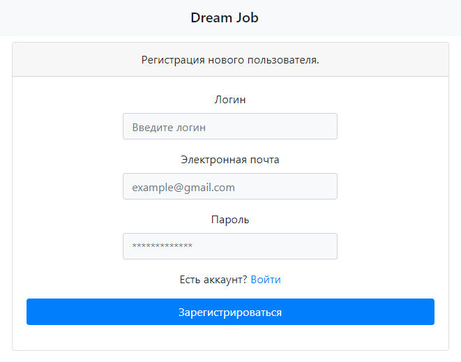
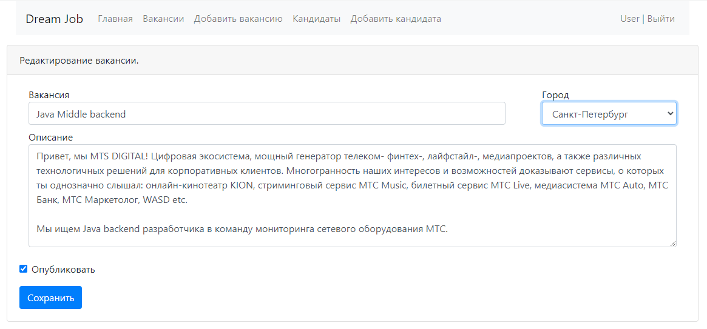
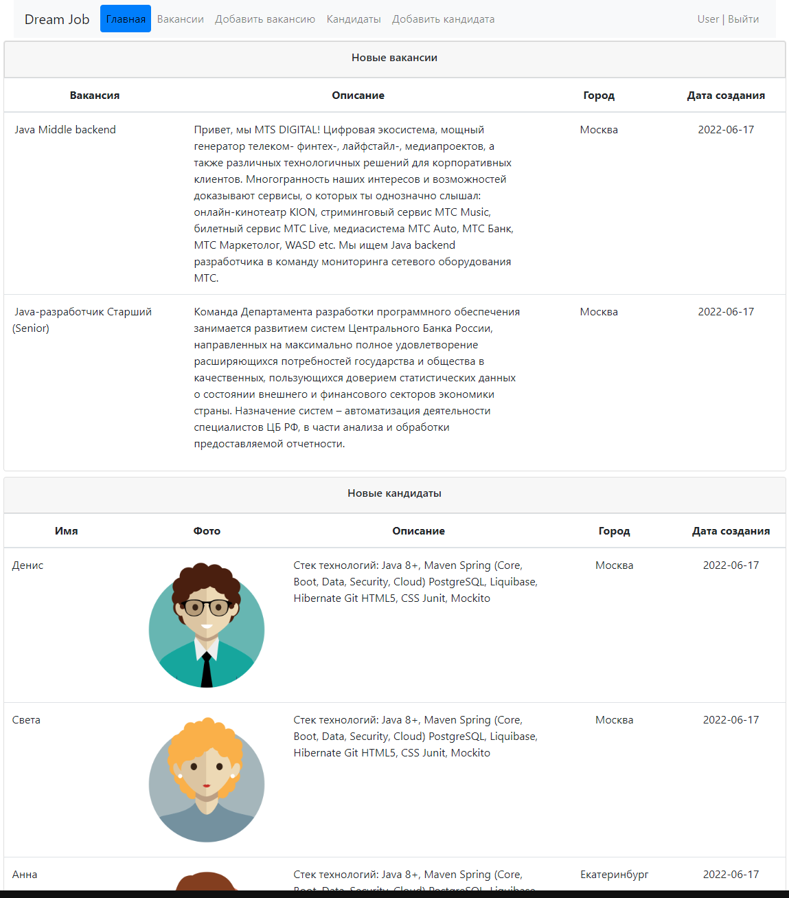

# Проект - Dream job

## О проекте

* Приложение представляет собой биржу труда с web-интерфейсом
* Пользователь может быть как кандидатом так и HR. Кандидаты могут вносить в систему данные о себе:

* HR могут публиковать вакансии о работе:

* Только авторизованные пользователи могут просматривать списки вакансий и кандидатов,
  а также добавлять новые. Авторизация построена на основе фильтра (класс AuthFilter). 
* Все зарегистрированные пользователи
  хранятся в БД. Форма авторизации:

* Есть возможность регистрации новых пользователей. Форма регистрации: 

* В качестве системы логирования используется связка log4j и slf4j.
* Для отображения авторизованного пользователя на всех страницах используется объект Session.

## Использование

Переходим на главную [страницу](http://localhost:8080/dreamjob/) приложения:
Регистрируемся:

Авторизуемся:

Добавим вакансию:

Отредактируем добавленную вакансию:

Добавим кандидата:

Проверим, что информация на главной странице обновилась:

